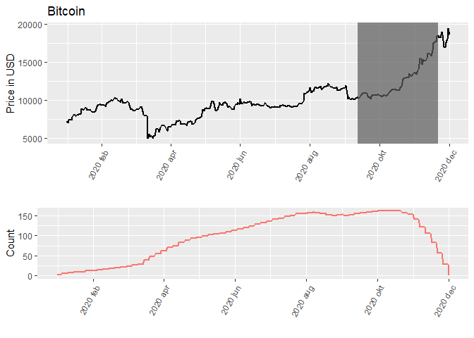

<!-- README.md is generated from README.Rmd. Please edit that file -->

# GSADF.AAU

<!-- badges: start -->

<!-- badges: end -->

The goal of GSADF.AAU is to implement the bubble detection method of
GSADF.

## Installation

You can install the released version of GSADF.AAU from
[GitHub](https://github.com/) with:

``` r
# install.packages("devtools")
devtools::install_github("Rasmusdamaau/GSADF.AAU")
```

``` r
library(GSADF.AAU)
gsadf <- GSADF(ticker = "btc-usd",
                          x = NULL,
                          min_window = 60,
                          step_length = 5,
                          window_increase = 10,
                          date_from = "2020-01-01",
                          date_to = "2020-12-01",
                          drift = F,
                          trend = F,
                          risk_free_rate = 0.01,
                          own_df_distribution = NULL)
#> Registered S3 method overwritten by 'quantmod':
#>   method            from
#>   as.zoo.data.frame zoo

head(gsadf)
#> $stock
#> # A tibble: 336 x 2
#>    date       price
#>    <date>     <dbl>
#>  1 2020-01-01 7200.
#>  2 2020-01-02 6985.
#>  3 2020-01-03 7344.
#>  4 2020-01-04 7410.
#>  5 2020-01-05 7410.
#>  6 2020-01-06 7768.
#>  7 2020-01-07 8162.
#>  8 2020-01-08 8078.
#>  9 2020-01-09 7877.
#> 10 2020-01-10 8164.
#> # ... with 326 more rows
#> 
#> $result
#> # A tibble: 812 x 7
#> # Rowwise: 
#>     estimate std_error t_value start_day end_day interval_length p_val
#>        <dbl>     <dbl>   <dbl>     <dbl>   <dbl>           <dbl> <dbl>
#>  1  0.00191    0.00352   0.543         0      60              60 0.821
#>  2  0.00238    0.00344   0.693         5      65              60 0.854
#>  3 -0.000808   0.00358  -0.226        10      70              60 0.589
#>  4 -0.00622    0.00650  -0.956        15      75              60 0.302
#>  5 -0.00536    0.00695  -0.772        20      80              60 0.378
#>  6 -0.00439    0.00722  -0.607        25      85              60 0.444
#>  7 -0.00734    0.00736  -0.997        30      90              60 0.285
#>  8 -0.00628    0.00759  -0.828        35      95              60 0.356
#>  9 -0.00817    0.00777  -1.05         40     100              60 0.264
#> 10 -0.0102     0.00802  -1.28         45     105              60 0.189
#> # ... with 802 more rows
```

``` r

plot_GSADF(u = gsadf,
                      d = NULL,
                      d_t = NULL,
                      p_restrict = 0.95,
                      start_date_tq_get = "2020-01-01",
                      image_name = NULL,
                      valuta = "USD",
                      aktie = "Bitcoin")
```



``` r

tabel_gsadf <- Tabel_GSADF(gsadf = gsadf)

tabel_gsadf
#> $count
#> [1] 2
#> 
#> $value
#> [1] 0.9996
#> 
#> $interval_longest
#> [1] "2020-09-12" "2020-11-21"
#> 
#> $price_change_longest
#> [1] "78.69 %"
#> 
#> $mean_startday
#> [1] "2020-09-17"
#> 
#> $mean_endday
#> [1] "2020-11-21"
```
